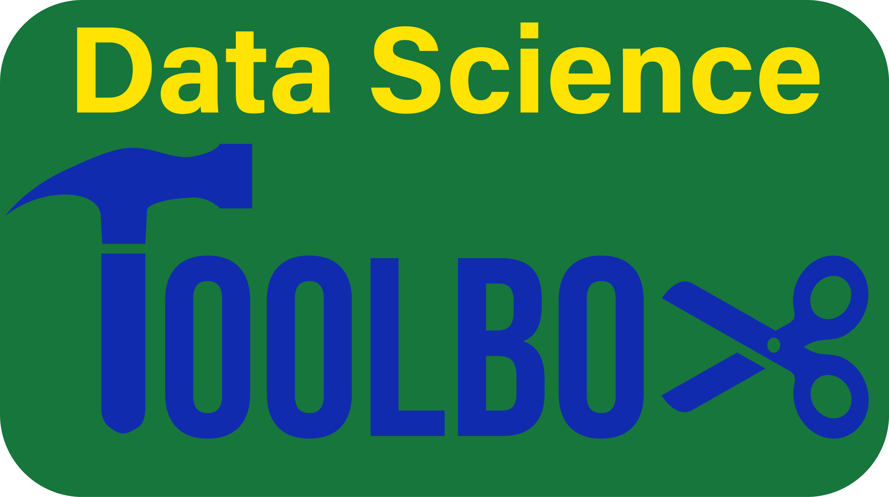

# _Jupyterlab Practice_
</img>

## The Data Science Toolbox 
</img>
### Assignment 7
#### Module 7: JupyterLab
In this module, you will learn about JupyterLab, one of the most popular development environments for data science projects.

 
</img>

### Assignment 8
#### Module 8: Jupyter Book
In this module you will learn how to create beautiful, publication-ready books and websites using Jupyter Book.

 
</img>

You can find my final project through this link. 🙂
https://norikokono.github.io/portfolio/intro.html
